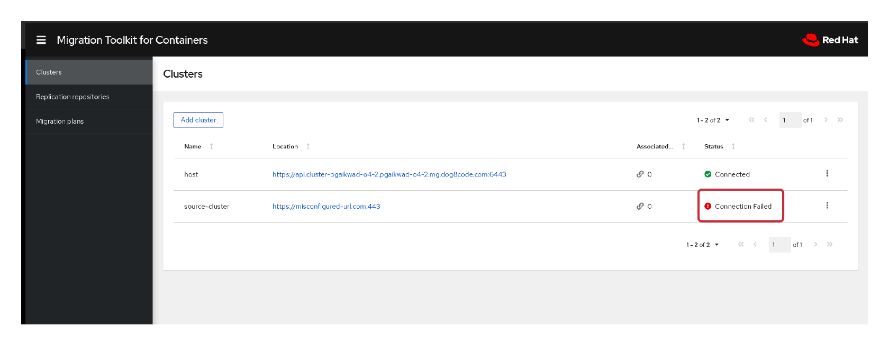
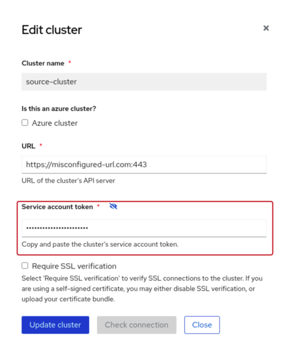
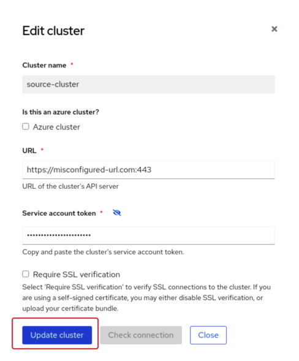
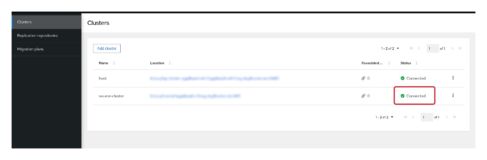
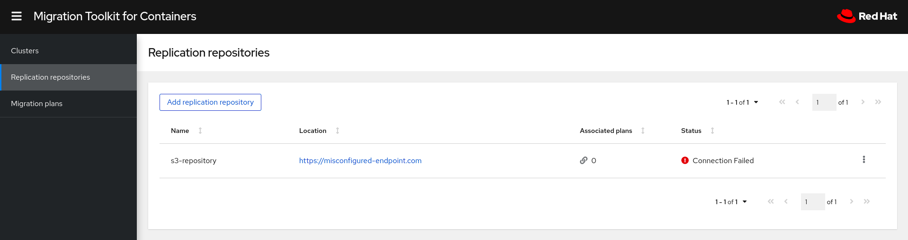
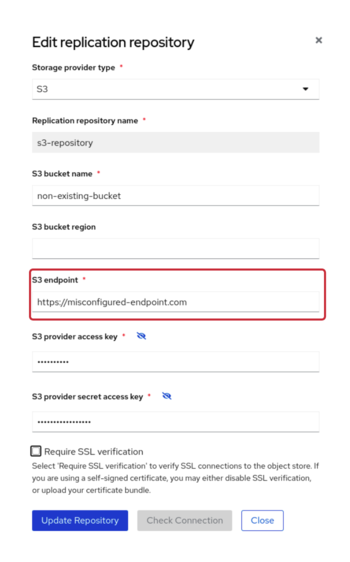
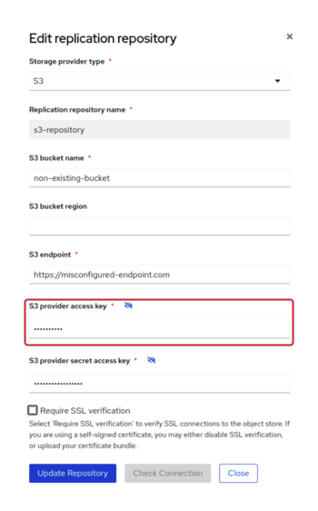

# Exercise 1 : Misconfiguration

This exercise helps users create misconfigured MTC custom resources. The users are expected to fix the misconfigured resources to drive a successful migration.

## Create CRs

Login to your destination cluster and create the CRs using:

```sh
oc apply -f 01-misconfig.yml
```

This will create _Cluster_ and _Replication Repository_ resources that are intentionally misconfigured.

### Fix

#### Fix MigCluster

The Cluster that we just created in the previous step can be found in the MTC UI under `Clusters` tab as shown below:



The cluster named `source-cluster` has status _Connection Failed_ reported on it. There are different reasons why the cluster is in failed state:

* Wrong URL to the source cluster

Use the dropdown menu to find the _Edit_ option for the cluster. When clicked, it will open a modal which displays the information about the Cluster. Notice that the _URL_ field has a wrong URL:


Copy the right URL of your source cluster in this field.

* Wrong Service Account Token

In the same modal, find the _Service account token_ field:



The field contains a wrong SA token. To get the service account token for your source cluster, login to your source cluster and run:

```yml
oc sa get-token migration-controller -n openshift-migration
```

The above command will print the SA token in your terminal window, copy it and paste it in the field shown above. 

Now click the `Update cluster` button on the opened modal to save the new values:



The Cluster resource now should show `Connected` in the _Status_ field:



#### Fix MigStorage

This section assumes that the users have already created an object storage bucket to use as MTC Replication Repository on their destination cluster. The lab environment already has Minio installed. The users can use it as backing store for their replication repository. To create a new bucket in Minio, please follow the following documentation:

[Object-Storage-Setup](https://github.com/konveyor/mig-agnosticd/blob/master/demos/2020_Summit/labs/2.md#26-object-storage-setup)

Once set up, navigate to _Replication Repositories_ tab in the MTC UI. You should find the repository named `s3-repository` which we created in the first step:



The _Status_ of the repository is shown as _Connection Failed_. There are different reasons why the repository could be in a failing state:

* Wrong S3 Endpoint

Since this is a S3 compatible object storage, we need to provide a valid S3 endpoint. Login to your desination cluster and find the Minio S3 URL:




Login to your destination cluster and find the Minio S3 URL: 

```sh
oc get route -n gpte-minio minio -o go-template='{{ .spec.host }}'
```

_Edit_ the Replication Repository by clicking Edit option in the dropdown menu and paste the URL under `S3 Endpoint` field. Do not forget to prefix the URL with `http://`.


* Wrong bucket name

Replace the _S3 bucket name_ field with the name of the bucket you created in Minio.

* Wrong Credentials

Use `minio` as _S3 provider access key_ and `minio123` as _S3 provider secret access key_ fields, respectively.




Once both these issues are fixed, you should see the repository in a _Connected_ state:


