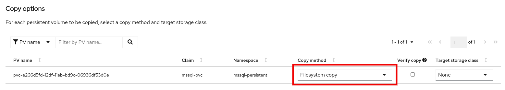
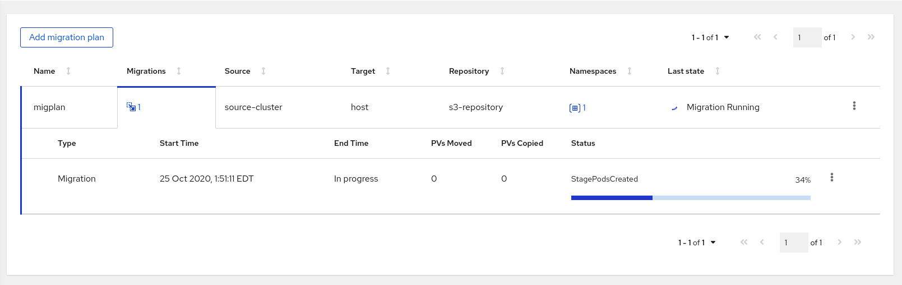

# Exercise 3 : Stage Pod Failures

When filesystem copy mode is selected, MTC makes use of temporary pods which attach the PVs and trigger a filesystem copy through Restic. In this exercise, we will trigger a failure in the Stage Pods and try to fix the issue manually.

## Prepare 

MTC uses `migration-cluster-config` configmap to allow users to modify image used for temporary stage pods. 

Login to your source cluster and edit the configmap using:

```sh
./03-stage-pod.sh
```

Wait until the operator recreates a new configmap:

```sh
[pranav@dragonfly 02-Stage-Pods]$ oc get configmap migration-cluster-config
NAME                       DATA   AGE
migration-cluster-config   2      1m
```

## Migrate

Now we will migrate an application from source to the destination cluster. When creating a migplan, make sure you choose 'File System Copy' mode for PVs:



Once the migplan is created successfully, migrate the application. 

Notice that the migration will get stuck at `StagePodsCreated` phase:



This is expected as we deliberately set a wrong image for stage pods. 

### Investigate

Login to your source cluster and see if the Stage Pods are running:

```sh
[pranav@dragonfly 02-Stage-Pods]$ oc get pods -n mssql-persistent
NAME                                    READY   STATUS             RESTARTS   AGE
mssql-app-deployment-85ddc6946b-r6r6b   1/1     Running            0          5d
mssql-deployment-1-l9sp2                1/1     Running            0          5d
stage-mssql-deployment-1-l9sp2-9tkfm    0/1     ImagePullBackOff   0          1h
```

Note that the stage pods are created in the namespace in which the application is running. In this case, we are migrating an app deployed in `mssql-persistent` namespace. It is clear from that the stage pods are in `ImagePullBackOff` state because of the wrong image we provided.

## Fix 


### Cancel the migration

We will now use the `Cancel` migration feature to cancel the ongoing migration. From the dropdown menu on the right side of the MigPlan, click `Cancel` option and wait until the migration is canceled completely. Canceling an ongoing migration will also delete the pending Stage Pods. 

### Fix the stage pod image

Restore the stage pod image using: 

```sh
./03-stage-pod-restore.sh
```

### Retry migration

Once the original image is restored, retry the migration of the same application.
