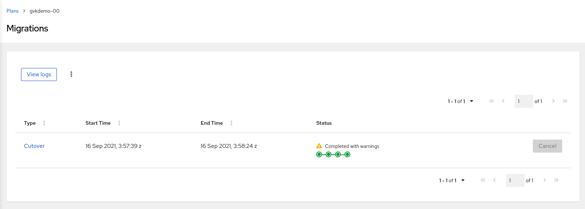
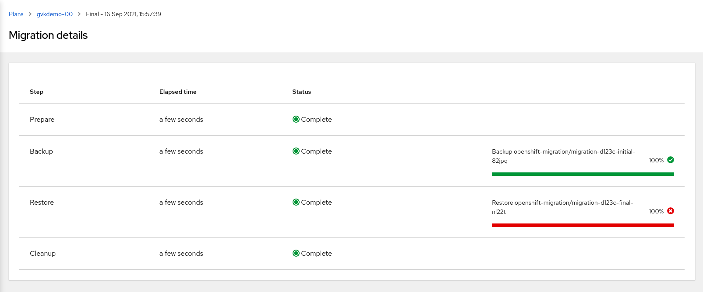
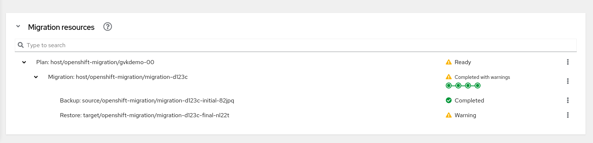
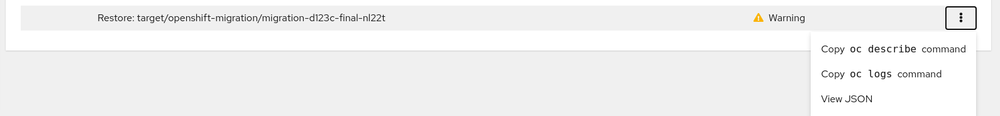

# Exercise 3 : GVK Incompatibility

This exercise guides users through a failed migration scenario due to incompatible GVKs between the source and the destination cluster. It helps users identify the problem on their own by investigating different migration resources.

## Prepare 

To perform this exercise, we will install a new Custom Resource Definition on the source and the destination cluster. The version of the CRD on the destination cluster will be different from that of the source cluster. 

Login to your source cluster and deploy the Custom Resource Definition:

```sh
oc apply -f 03-source-crd.yml
```

Wait until the CRD is created on the source cluster. You can confirm whether the CRD is created by running:

```sh
oc get crd gvkdemoes.konveyor.openshift.io
```

Create the namespace and an instance of the CRD on the source cluster:

```sh
oc apply -f 03-source-ns.yml
oc apply -f 03-source-cr.yml
```

This will create a namespace `gvk-demo` on your source cluster and deploy an instance of Custom Resource in it.

Login to your destination cluster and deploy the Custom Resource Definition:

```sh
oc apply -f 03-dest-manifest.yml
```


## Migrate GVK incompatible namespace

On your destination cluster, create a new MigPlan to migrate namespace `gvk-demo`. 


Run a migration by clicking _Migrate_ option from the dropdown menu on the migplan.

The migration will complete with message `Completed with warnings`:



The Warning message indicates that the migration went to completion, however, one of the steps in the migration failed. Navigate to the details page of the migration by clicking on the link under the `Type` column:



As shown in the details page above, `Restore` step in migration failed. This step is responsible for restoring Kubernetes objects in the target cluster.
## Investigate

MTC UI displays a _Debug View_ to list Kubernetes resources created during a migration. It is updated dynamically as and when the new resources are created or when there are updates to the existing resources. It can be found on the migration details page at the bottom of the page:



Find the Restore that appears to have problems and click on the dropdown menu: 



Click `copy oc describe command` link. It will copy the `oc` command to the clipboard. Login to the destination cluster and run the command:

```sh
[nobody@dragonfly ~]$ oc describe restore --namespace openshift-migration migration-d123c-final-nl22t
Name:         migration-d123c-final-nl22t
Namespace:    openshift-migration
Labels:       app.kubernetes.io/part-of=openshift-migration
              migmigration=4993595a-995f-45df-9d4e-80161a716dc9
              migration-final-restore=4993595a-995f-45df-9d4e-80161a716dc9
              migration.openshift.io/migmigration-name=migration-d123c
              migration.openshift.io/migplan-name=gvkdemo-00
              migration.openshift.io/migrated-by-migmigration=4993595a-995f-45df-9d4e-80161a716dc9
              migration.openshift.io/migrated-by-migplan=e0d4b8d6-3ddc-4ff2-8c41-3f15bbb98d56
Annotations:  migration.openshift.io/migmigration-type: final
API Version:  velero.io/v1
Kind:         Restore
Metadata:
  Creation Timestamp:  2021-09-16T15:58:01Z
  Generate Name:       migration-d123c-final-
  Generation:          6
  Resource Version:  4208804
Spec:
  Backup Name:  migration-d123c-initial-82jpq
  Excluded Resources:
    nodes
    events
    events.events.k8s.io
    backups.velero.io
    restores.velero.io
    resticrepositories.velero.io
  Hooks:
  Restore P Vs:  true
Status:
  Completion Timestamp:  2021-09-16T15:58:05Z
  Errors:                1
  Phase:                 PartiallyFailed
  Progress:
    Items Restored:  23
    Total Items:     23
  Start Timestamp:   2021-09-16T15:58:01Z
  Warnings:          7
Events:              <none>
```

By inspecting the `Status` field of the resource above we can see that the restore `PartiallyFailed`.

We will now locate the tarball associated with this restore in the _Replication Repository_ and download the archive. 

Login to the minio UI, and find the bucket you created in the previous exercise. Within the bucket, find the directory associated with the restore by navigating through `velero -> restores -> <your_restore_directory>`. The restore directory is named after the name of the Velero Restore mentioned in _MigMigration_.


Download the `restore-<restore_name>-results.gz` archive. Extract the archive to find a file which contains useful information about the partially failed restore. This file contains list of warnings and errors in a JSON format. We are interested in knowing the errors:

```json
{"errors":{"namespaces":{"gvk-demo":["error restoring gvkdemoes.konveyor.openshift.io/gvk-demo/gvk-demo: the server could not find the requested resource"]}}}
```

From the error message above, it is clear that Velero failed to restore the Custom Resource `gvkdemoes.konveyor.openshift.io` we created. 


